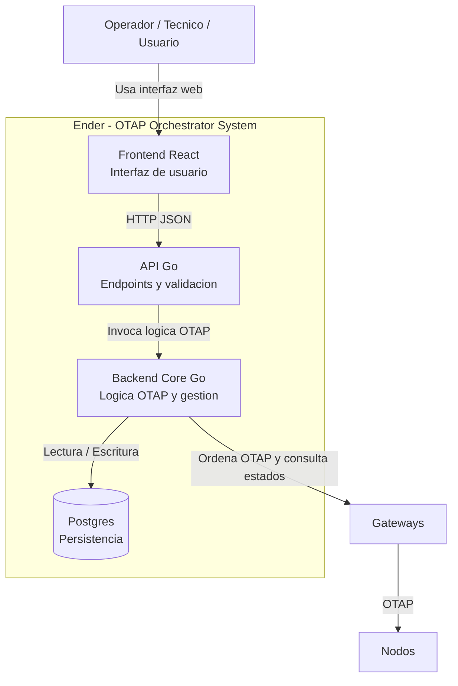

## Descripción del sistema

Ender es un orquestador de campañas OTAP para redes Wirepas.
Permite a operadores planificar y supervisar actualizaciones de nodos/luminarias a través de gateways.
El sistema contiene un Frontend (React) y un Backend (Go), que gestionan campañas, nodos, gateways y organizaciones.
Ender se comunica con los gateways mediante las librerías OTAP proporcionadas por Wirepas y almacena el estado en Postgres.

## Actores externos

Operador / Técnico: usa la UI para planificar campañas y revisar estados.

Gateways Wirepas: reciben órdenes OTAP y reportan estados.

Nodos / Luminarias: dispositivos finales que reciben la actualización mediante la red mesh.

---

## Diagrama C4 Level 1

---

[Volver al README](../../README.md)