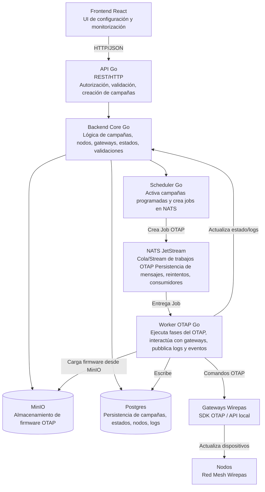

## C4 Level 2 – Containers (Ender + NATS JetStream)

Este nivel describe cómo se divide Ender internamente y cómo se comunica con los sistemas externos.

Incluye:

- Frontend React

- API (Go)

- Service Layer / Backend Core

- Scheduler

- Worker OTAP

- Postgres

- NATS JetStream

- MinIO

- Gateways Wirepas

- Nodos/luminarias

---

---

[Volver al README](../../README.md)