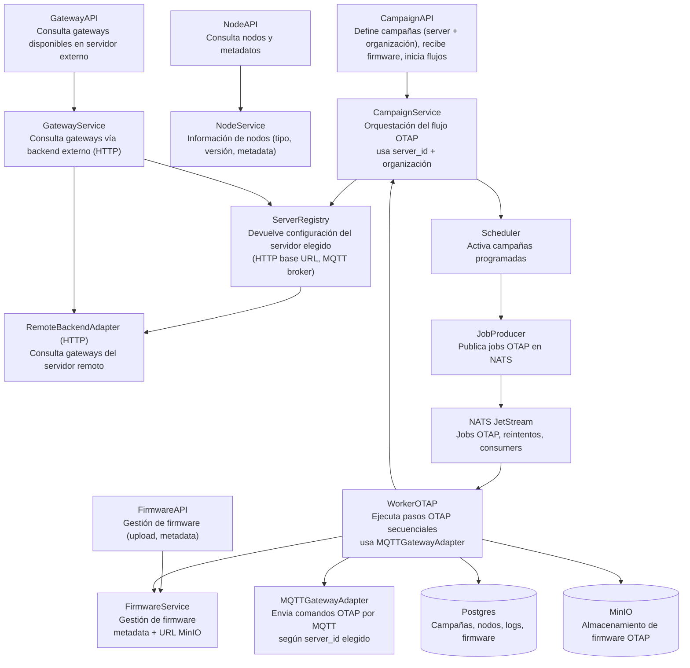
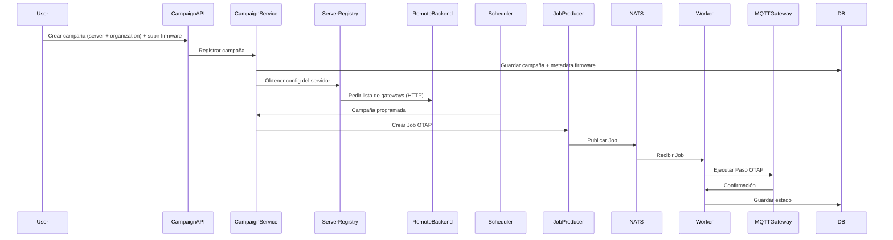

# C4 Level 3 – Backend Components (Ender)

Este documento describe los componentes internos del Backend de Ender.  
Refina la vista de contenedores del Level 2 y muestra cómo se estructura la lógica interna del sistema.

Ender no ejecuta el OTAP en los nodos.  
El gateway es quien realiza realmente el proceso OTAP.  
Ender se encarga de **coordinar**, **secuenciar pasos**, **almacenar firmware**, **comunicarse por HTTP y MQTT con servidores externos**, **publicar trabajos** y **actualizar el estado de la campaña**.

---

## Vista principal de Componentes



---

## Descripción de componentes

### CampaignAPI

- Punto de entrada principal para el frontend:

    - Crea campañas

    - Recibe firmware

    - Permite seleccionar servidor remoto + organización

    - Lanza campañas manuales

    - Consulta su estado


### NodeAPI

- Consulta nodos locales (solo metadatos):

    - tipo

    - versión

    - estado

    - configuración


### GatewayAPI

- Permite:

    - listar gateways de la organización en el servidor remoto seleccionado

    - consultar su estado (si el backend remoto lo ofrece)

    - Esta API NO habla con gateways directamente.


### CampaignService (núcleo del backend)

- Responsable de:

    - Secuenciar el OTAP

    - Validar respuestas del gateway

    - Gestionar timeouts y reintentos

    - Interactuar con MinIO para firmware

    - Interactuar con ServerRegistry para obtener información de servidores

    - Publicar jobs NATS

- Avanzar pasos según confirmaciones del Worker OTAP

- Es el orquestador real dentro de Ender.


### NodeService

- Consulta nodos de la base de datos

- No implementa validaciones de compatibilidad (eso lo hace el gateway)

- FirmwareService

- Guarda firmware en MinIO

- Mantiene metadatos en DB

- Expone URL segura para el gateway

- No valida compatibilidad


### ServerRegistry

- Responsable de:

    - devolver información del servidor seleccionado por el usuario

- proporcionar:

    - HTTP base URL para consultar gateways

    - MQTT broker del servidor

    - asegurar que el server_id es válido

Ejemplos:

```sginx
prod → https://prod-backend/api + mqtt.prod.server
senegal → https://senegal-backend/api + mqtt.senegal.server
```

### RemoteBackendAdapter (HTTP)

- Responsable de:

    - consultar gateways de una organización en el servidor remoto seleccionado

    - obtener información de estado si procede


### MQTTGatewayAdapter

- Publica comandos OTAP al topic adecuado del gateway

- Escucha respuestas

- Maneja timeouts y errores

- Está aislado del modelo Wirepas interno

- Se conecta al MQTT broker correspondiente a server_id

- Scheduler

- Activa campañas programadas → crea jobs OTAP.


### JobProducer

- Publica pasos OTAP en NATS JetStream. 
- Cada mensaje representa un paso de la campaña.


### WorkerOTAP

Ejecuta la secuencia:

```perl
step1 → confirmar → update state → step2 → confirmar …
```

Y además:

- descarga firmware desde MinIO

- usa MQTTGatewayAdapter

- actualiza DB

- alimenta logs y progreso


### Repositories

Repos para Campaign, Node, Gateway, Firmware, Logs.


### Flujo OTAP Simplificado



---

[Volver al README](../../README.md)
