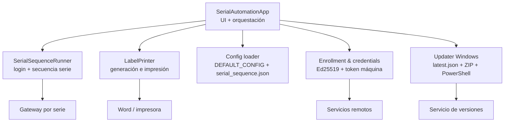

# C4 - Nivel 3 - Componentes de la aplicación

## Resumen

El módulo principal `gateway_serial_tool.py` contiene varias áreas funcionales. Aunque no estén separadas en paquetes, sí representan componentes lógicos claros.

## Diagrama

## Componentes

### `SerialAutomationApp`

**Responsabilidad principal**

- Construir la interfaz Tkinter.
- Refrescar puertos y detectar gateways.
- Lanzar la secuencia en segundo plano.
- Sincronizar estados, timer, log y eventos de UI.
- Orquestar impresión automática y manual.
- Ejecutar validación de update obligatorio al arranque.

**Entradas**

- Interacciones del usuario.
- Eventos de cola interna.
- Estado del sistema operativo y puertos serie.

**Salidas**

- Mensajes de estado/log.
- Invocación a runner serie.
- Llamadas HTTP a servicios remotos.
- Peticiones de impresión.

### `SerialSequenceRunner`

**Responsabilidad principal**

- Abrir el puerto serie.
- Gestionar login del gateway.
- Resolver contraseñas vigentes y cambios obligatorios de password.
- Ejecutar la secuencia de pasos declarativos.
- Esperar prompts, detectar timeouts y reportar salida útil.

**Detalles importantes**

- Usa una secuencia declarada en JSON, no comandos hardcodeados en cada flujo.
- Tiene lógica específica para `sudo`, detección de prompt y normalización de salida ANSI.
- Mantiene contexto renderizable (`lat`, `lon`, `current_password`, etc.).

### `LabelPrinter`

**Responsabilidad principal**

- Formatear el texto de etiqueta.
- Crear documentos temporales `.docx`.
- Usar una plantilla si existe, o un documento básico si no.
- Automatizar Word por COM en Windows para imprimir copias.

**Restricciones**

- La impresión automática solo está soportada en Windows.
- Depende de `pywin32` y de Microsoft Word instalado.

### Capa de configuración

**Responsabilidad principal**

- Cargar `serial_sequence.json` o usar `DEFAULT_CONFIG`.
- Definir templates `curl`, shell prompt y timeouts.
- Mantener el flujo adaptable sin tocar tanto código.

### Capa de seguridad y credenciales

**Responsabilidad principal**

- Leer y persistir token de máquina.
- Generar o recuperar clave privada Ed25519 del dispositivo operador.
- Firmar requests al backend.
- Obtener credenciales runtime (`username`, `default_password`, `new_password`).
- Ejecutar enrolado con `enroll_code`.

### Updater Windows

**Responsabilidad principal**

- Consultar `latest.json` al arrancar.
- Verificar versión, `install_mode` y `sha256`.
- Descargar ZIP, validar integridad y reemplazar el `.exe` actual.
- Lanzar un script PowerShell temporal que espera el cierre del proceso activo.

## Deuda técnica visible

- Existe una arquitectura lógica, pero no una separación física por módulos/paquetes.
- `SerialAutomationApp` mezcla coordinación de UI, seguridad, actualización, enrolado y lógica de dominio.
- El siguiente salto natural sería extraer capas: `ui/`, `serial/`, `printing/`, `security/`, `update/`.
