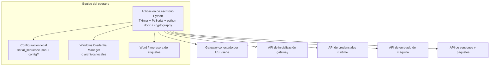

# C4 - Nivel 2 - Contenedores

## Resumen

En el estado actual, el sistema tiene un contenedor principal muy dominante: una **aplicación de escritorio Python**. Alrededor de ella existen contenedores/sistemas externos con los que intercambia datos o comandos.

## Diagrama

## Contenedores

### 1. Aplicación de escritorio Python

**Responsabilidad**

- Gestionar la UI.
- Detectar puertos y comprobar si el dispositivo parece un gateway.
- Ejecutar la secuencia serie parametrizada.
- Obtener credenciales runtime.
- Enrolar la máquina del operador.
- Gestionar impresión de etiquetas.
- Aplicar actualización obligatoria en Windows.

**Tecnologías**

- Python
- Tkinter
- PySerial
- `urllib`
- `cryptography` (Ed25519)
- `python-docx`
- `pywin32` en Windows
- PyInstaller para empaquetado

### 2. Configuración local

**Responsabilidad**

- Ajustar baudrate, timeouts, prompts y pasos serie.
- Definir plantillas `curl` por destino (`serial_sequence.json`).
- Persistir token de máquina y, fuera de Windows, la clave privada del dispositivo.

### 3. Gateway conectado por USB/serie

**Responsabilidad**

- Exponer login y shell serial.
- Ejecutar `autorun.sh` con privilegios `sudo`.
- Emitir logs y marcadores de éxito consumidos por la aplicación.

### 4. Servicios remotos

**Responsabilidad**

- Entregar scripts de inicialización parametrizados por destino.
- Devolver credenciales runtime.
- Registrar/enrolar la máquina operadora.
- Publicar metadatos y binarios de actualización.

### 5. Word / impresora de etiquetas

**Responsabilidad**

- Renderizar documentos `.docx` con el texto de etiqueta.
- Enviar trabajos de impresión al dispositivo físico.

## Riesgos y observaciones

- La aplicación centraliza demasiadas responsabilidades, lo que simplifica despliegue pero concentra el acoplamiento.
- Hay dependencia fuerte de Windows para impresión automática y auto-update del ejecutable.
- Las APIs remotas son críticas: sin ellas, la herramienta pierde enrolado, credenciales y actualización.
