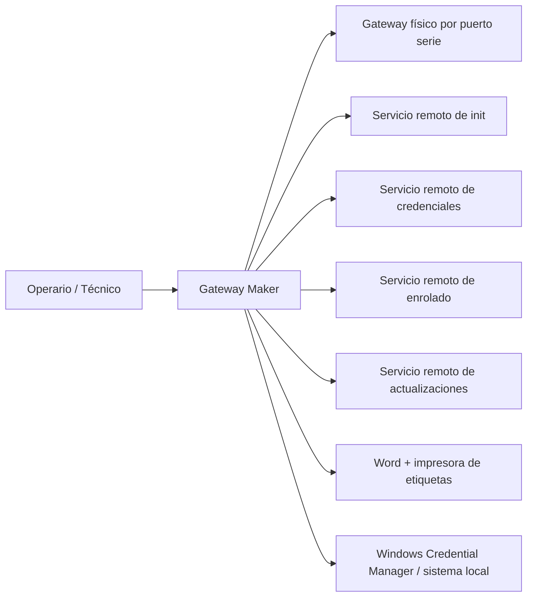

# C4 - Nivel 1 - Contexto del sistema

## Descripción

**Gateway Maker** se utiliza por personal de operación/fabricación para preparar gateways físicos a través de una conexión serie. La aplicación orquesta interacciones locales con el equipo y llamadas HTTP con la plataforma remota de Salvi Lighting.

## Actores

- **Operario / técnico**: usa la interfaz gráfica para seleccionar destino, lanzar la secuencia, validar estado y disparar impresión manual si hace falta.
- **Gateway físico**: equipo conectado por USB/serie que expone login shell y ejecuta el script de inicialización.
- **Servicios remotos de gateway**: endpoints HTTP(s) que entregan metadatos de actualización, credenciales runtime, enrolado de máquina y scripts de inicialización.
- **Sistema operativo Windows**: entorno principal de distribución cuando se usa el ejecutable compilado, con integración con Word/COM y Credential Manager.
- **Impresora / Microsoft Word**: infraestructura usada para producir etiquetas físicas.

## Diagrama

## Relaciones principales

- El operario inicia la automatización desde una GUI Tkinter.
- La aplicación detecta el dispositivo y ejecuta comandos sobre el puerto serie.
- El gateway descarga `autorun.sh` desde el backend remoto usando `curl`.
- La aplicación obtiene credenciales dinámicas desde un backend autenticado por token de máquina y firma Ed25519.
- El sistema guarda secretos de máquina localmente: en Windows Credential Manager o en archivos bajo `config/` en otros entornos.
- La aplicación genera etiquetas y las envía a Word para impresión automática o manual.
- En Windows, la aplicación valida si existe una actualización obligatoria y, si procede, descarga y sustituye el `.exe` actual.

## Notas

- Aunque hay carpetas `docs/`, `config/` y artefactos de build, la lógica operativa reside en un solo módulo Python.
- El contexto deja claro que el sistema depende de infraestructura externa y de hardware específico; no es una utilidad puramente local.
