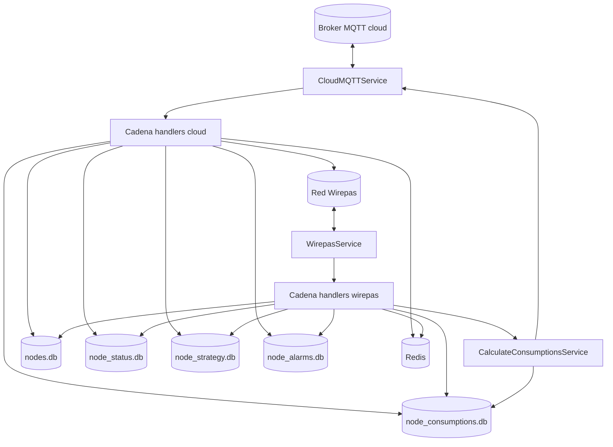
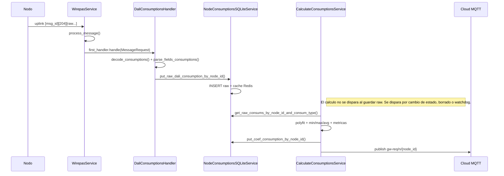

# 01. Arquitectura

## Vision global

El gateway mezcla dos capas:

- telecomunicaciones: clientes MQTT y Wirepas, arranque y callbacks;
- logica de negocio: handlers, calculos, SQLite, Redis y watchdogs.

La extraccion de fase 2 debe sacar la segunda capa y dejar en este repo solo la primera. El wiring actual arranca en `main.py:63-167`, construye dependencias con `services/manager_service.py:24-213`, y entrega esas dependencias dentro de `ServicesRequest`/`MessageRequest` (`models/services_request.py:4-35`, `models/message_request.py:4-53`).

## Flujo global

Referencias:

- arranque general: `main.py:68-152`;
- dispatcher Wirepas: `services/wirepas_service.py:62-246`;
- dispatcher cloud: `services/cloud_mqtt_service.py:251-370`.

## Ejemplo completo: `msg_type=204` DALI consumption

## Patron Chain of Responsibility

El contrato base es minimo:

- `BaseHandler.set_next(handler)` enlaza el siguiente elemento (`handlers/base_handler.py:12-23`);
- `BaseHandler.handle(request)` pasa el `request` al siguiente si el handler actual no lo consume (`handlers/base_handler.py:25-36`).

Cada handler concreto sigue la misma estructura:

1. copiar `request` a atributos internos;
2. decidir con `can_handle()`;
3. ejecutar `init()` o delegar al siguiente.

## Requests e inyeccion de dependencias

`ServicesRequest` mete en un solo objeto las dependencias compartidas (`models/services_request.py:4-35`):

- telecom: `cloud_mqtt_service`, `local_mqtt_service`, `wirepas_service`;
- persistencia/cache: `redis_service`, `nodes_sqlite_service`, `node_consumptions_sqlite_service`, `node_status_sqlite_service`, `node_strategy_sqlite_service`, `node_alarms_sqlite_service`.

`MessageRequest` añade el contexto del mensaje (`models/message_request.py:5-37`):

- identificacion: `node_id`, `msg_type`;
- raw: `payload`, `payload_bytes`, `data`, `travel_time_ms`;
- dependencias heredadas del `ServicesRequest`.

`MessageRequest.copy_with()` se usa para `UNIC_MSG`: crea subrequests sin reinstanciar servicios (`models/message_request.py:42-53`).

## Cadenas reales

### Wirepas → cloud

Orden actual en `services/wirepas_service.py:94-156`:

1. `CheckNodeHandler`
2. `UnicMsgHandler`
3. `NodeRequestUnixtimeHandler`
4. `NodeStatusHandler`
5. `RGBStatusHandler`
6. `OldNodeStatusHandler`
7. `DaliConsumptionsHandler`
8. `SolarConsumptionsHandler`
9. `AllegroConsumptionsHandler`
10. `DaliAllegroConsumptionsHandler`
11. `LumosMaximaHandler`
12. `NodeStrategyHandler`
13. `AlphaConsumptionsHandler`
14. `BatteryThresholdHandler`
15. `NodeKitHandler`
16. `SettedSolarStrategyHandler`
17. `AlarmsToNodeHandler`
18. `StatusRawConsumptionsHandler`
19. `RecoverDaliLostConsumptionsHandler`
20. `ConfigSensorHandler`
21. `DefaultHandler`

### Cloud → nodo

Orden actual en `services/cloud_mqtt_service.py:283-304`:

1. `OnOffSwitchStatusHandler`
2. `NewStrategyHandler`
3. `RequestRawConsumptionHandler`
4. `AlarmsToCloudHandler`
5. `SendPositioningHandler`
6. `DeleteOldNodeHandler`
7. `KitHandler`
8. `NewSolarStrategyHandler`
9. `DefaultHandler`

### Cloud → gateway

Orden actual en `services/cloud_mqtt_service.py:311-318`:

1. `DeleteOldNodeHandler`
2. `SendPositioningHandler`
3. `DefaultHandler`

## Callbacks de entrada

### Wirepas

`WirepasService.register_traffic_cb()` registra `on_data_rx()` contra la libreria Wirepas (`services/wirepas_service.py:161-163`). El callback real:

- ejecuta `process_message()` en `ThreadPoolExecutor` (`services/wirepas_service.py:201-205`);
- extrae `node_id`, payload y `msg_type=payload[2]` (`services/wirepas_service.py:213-218`);
- filtra sinks, payloads vacios y algunos tipos ignorados (`services/wirepas_service.py:209-227`);
- construye `MessageRequest` y lanza la cadena (`services/wirepas_service.py:229-245`).

### Cloud MQTT

`CloudMQTTService.on_message()` separa por topic:

- `cl-*/gw/{GW_ID}` → `msg_to_gateway()` (`services/cloud_mqtt_service.py:323-331,352-370`);
- `cl-*/n/{node_id}` → `msg_to_node()` (`services/cloud_mqtt_service.py:323-331,333-350`).

En ambos casos el `msg_type` se toma de `payload[2]`.
