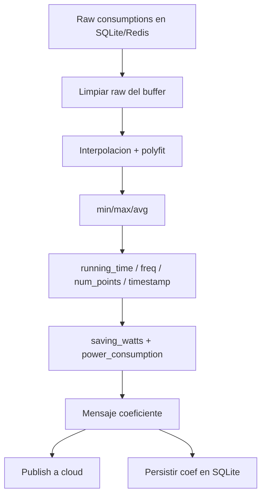

# 05. Calculo de consumos y coeficientes

## Flujo funcional

Entradas al calculo:

- cambio de estado (`BaseStatusHandler.calculate_consumptions()`, `handlers/wirepas_handler/status_handler/base_status_handler.py:126-131`);
- borrado de nodo (`DeleteOldNodeHandler.init()`, `handlers/cloud_mqtt_handler/delete_old_node_handler.py:69-79`);
- arranque cloud sobre nodos ya descubiertos (`CloudMQTTService.calculate_consumptions()`, `services/cloud_mqtt_service.py:165-173`);
- watchdog de nodos caidos (`services/watchdogs/check_nodes_keepalive_watchdog.py:231-245`);
- watchdog de consumos perdidos (`services/watchdogs/check_consumption_lost_watchdog.py:154-172`).

## `CalculateConsumptionsService.init()`

Fuente: `services/calculate_consumptions_service.py:63-82`.

Orden exacto:

1. `setup_data(data)`
2. `prepare_variables()`
3. `get_raw_consumptions()`
4. `clean_raw_consumptions()`
5. `init_process_consumptions()`
6. `add_consumptions_in_msg()`
7. `create_common_metrics()`
8. si no es solar:
   - `calculate_saving_watts()`
   - `calculate_power_consumption()`
9. `add_common_metrics_in_msg()`
10. `publish_consumptions()`

Efecto importante: el buffer raw se borra antes de publicar coeficientes (`services/calculate_consumptions_service.py:130-133`).

## Tipos de salida

`prepare_variables()` define el `msg_type` cloud del mensaje final (`services/calculate_consumptions_service.py:84-100`):

- DALI → `36`
- ALLEGRO → `37`
- SOLAR → `108`
- DALI_ALLEGRO → `38`

Topic de salida: `gw-req/n/{node_id}` (`services/calculate_consumptions_service.py:258-274`).

## Construccion por tipo

### DALI

Fuente: `services/calculate_consumptions_service.py:168-184`

Orden de bloques:

1. `voltage_cc_pcb` solo min/max/avg (`add_min_max_avg`)
2. `current_cc_pcb` coef + min/max/avg
3. `temperature_driver` coef + min/max/avg
4. `voltage_net_ca` coef + min/max/avg
5. `power_factor` solo min/max/avg
6. `apparent_power` coef + min/max/avg

### ALLEGRO

Fuente: `services/calculate_consumptions_service.py:186-194`

Orden:

1. `voltage_net_ca`
2. `power_factor` solo min/max/avg
3. `apparent_power`
4. `current_net_ca`

### SOLAR

Fuente: `services/calculate_consumptions_service.py:196-203`

Orden:

1. `SOC`
2. `battery_voltage`
3. `battery_current`
4. `luminaire_power`
5. `charge_power`

No calcula `saving_watts` ni `power_consumption`.

### DALI_ALLEGRO

Fuente: `services/calculate_consumptions_service.py:205-216`

Orden:

1. `voltage_pcb_cc` solo min/max/avg
2. `current_pcb_cc`
3. `temperature_driver`
4. `voltage_net_ca`
5. `power_factor_net_ca` solo min/max/avg
6. `apparent_power`
7. `current_net_ca`

## Algoritmo de ajuste

Fuente principal: `utils/consumptions.py:47-237`.

### 1. Limpieza de anomalias

`process_consumptions_data()` llama primero a `fixing_anomalies(consumptions)` (`utils/consumptions.py:47-50`).

`fixing_anomalies()`:

- ejecuta `fix_anomalies()` dos iteraciones (`utils/consumptions.py:115-121,239-242`);
- despues fuerza `consumptions[0] = consumptions[1]` (`utils/consumptions.py:117-119`).

La heuristica base compara diferencias contra `1/8` del valor anterior (`utils/consumptions.py:244-267`).

### 2. Normalizacion temporal

Si `total_times` son enteros:

- si son mayores que `1e15`, asume nanosegundos y divide entre `1_000_000_000` (`utils/consumptions.py:52-61`);
- si no, los trata como segundos (`utils/consumptions.py:62-68`).

Si no son enteros, interpreta strings ISO (`utils/consumptions.py:69-75`).

### 3. Rejilla ideal e interpolacion

- crea una rejilla cada 30 segundos con `np.arange(min, max + 30, 30)` (`utils/consumptions.py:77`);
- interpola linealmente sobre esa rejilla con `np.interp()` (`utils/consumptions.py:80`).

Nota: el ajuste final no usa directamente `filled_values_linear`, sino los timestamps reales normalizados a unidades de 30 s (`utils/consumptions.py:88-104`).

### 4. `np.polyfit`

- `x_fit = (time_seconds - time_seconds[0]) / 30.0` (`utils/consumptions.py:89`);
- grado = `min(max_poly, n_points - 1)` (`utils/consumptions.py:100`);
- `coef = np.polyfit(x_fit, y_fit, poly_degree)` (`utils/consumptions.py:101`);
- invierte el orden con `np.flip(coef)` para enviar coeficientes en orden ascendente de potencia (`utils/consumptions.py:103-104`).

### 5. Padding a `max_poly+1`

`adding_zeros_to_complet_consumptions()` serializa cada coeficiente como float LE y anade ceros hasta completar `max_poly + 1` coeficientes (`utils/consumptions.py:180-195`).

Con `max_poly=3`:

- 4 coeficientes x 4 bytes = 16 bytes.

### 6. Min/max/avg

`add_min_max_avg()` anade 3 floats LE (`min`, `max`, `median`) al final (`utils/consumptions.py:197-224`).

Eso son:

- 12 bytes por serie.

### 7. Tamano por serie

Para cualquier serie con ajuste polinomial de grado maximo 3:

- 16 bytes coeficientes
- 12 bytes min/max/avg
- total 28 bytes

Para series "sin polinomio" en este repo:

- se llama igualmente a `add_min_max_avg(data=[])`, asi que el bloque ocupa 12 bytes.

## Metricas comunes

Fuente: `utils/consumptions.py:32-44`.

Campos:

- `running_time`: uint32 little-endian
- `num_points_t`: uint16 little-endian
- `freq_gener_point`: uint16 little-endian, fijo `30`
- `timestamp`: epoch local en 4 bytes little-endian

`running_time` sale de `calculate_running_time()` (`utils/consumptions.py:278-299`), que para enteros hace simplemente `finish - init`.

## `saving_watts` y `power_consumption`

### Ahorro

Fuente: `utils/consumptions.py:322-346`

Formula:

`saving_watts = max(0, lumos_maxima - apparent_power_avg) * running_time / 3600`

Donde:

- `apparent_power_avg` se lee del ultimo float del bloque de `apparent_power` (`[-4:]`) (`utils/consumptions.py:324-325`);
- `lumos_maxima` sale de `nodes_sqlite_service.get_lumos_maxima_by_node_id()` (`utils/consumptions.py:326,359-361`);
- si el estado actual no es `NODE_ON`, el ahorro se fuerza a `0` (`services/calculate_consumptions_service.py:225-237`).

### Consumo energetico

Fuente: `utils/consumptions.py:347-357`

Formula:

`power_consumption = apparent_power_avg * running_time / 3600`

## Estructura final del mensaje

### DALI

`[0,0,36]`

- `voltage_cc_pcb`: 12 B
- `current_cc_pcb`: 28 B
- `temperature_driver`: 28 B
- `voltage_net_ca`: 28 B
- `power_factor`: 12 B
- `apparent_power`: 28 B
- `running_time`: 4 B
- `freq_gener_point`: 2 B
- `num_points_t`: 2 B
- `saving_watts`: 4 B
- `power_consumption`: 4 B
- `timestamp`: 4 B

Total: 129 bytes.

### ALLEGRO

`[0,0,37]`

- `voltage_net_ca`: 28 B
- `power_factor`: 12 B
- `apparent_power`: 28 B
- `current_net_ca`: 28 B
- metricas comunes no-solar: 20 B

Total: 119 bytes.

### SOLAR

`[0,0,108]`

- 5 series x 28 B = 140 B
- `freq_gener_point`: 2 B
- `num_points_t`: 2 B
- `running_time`: 4 B
- `timestamp`: 4 B

Total: 153 bytes.

### DALI_ALLEGRO

`[0,0,38]`

- `voltage_pcb_cc`: 12 B
- `current_pcb_cc`: 28 B
- `temperature_driver`: 28 B
- `voltage_net_ca`: 28 B
- `power_factor_net_ca`: 12 B
- `apparent_power`: 28 B
- `current_net_ca`: 28 B
- metricas comunes no-solar: 20 B

Total: 159 bytes.

## Persistencia de coeficientes

Despues de publicar, el mensaje completo se serializa con `json.dumps(data)` y se inserta en `coef_consumptions` (`services/calculate_consumptions_service.py:276-279`).

Campos:

- `node_id`
- `coef_type` (`dali`, `allegro`, `solar`, `dali_allegro`)
- `data` como JSON del array de bytes
- `time` en nanosegundos segun `time.time() * 1_000_000_000`

## Recuperacion de datos perdidos

1. `RecoverDaliLostConsumptionsHandler` guarda series en `*_lost` y crea flags (`handlers/wirepas_handler/consumptions_handler/recover_lost_consumptions/recover_dali_lost_consumptions_handler.py:204-239`).
2. `CheckConsumptionLostWatchdog` espera a tener las 3 flags o a superar `25 s` desde la primera (`services/watchdogs/check_consumption_lost_watchdog.py:99-118`).
3. `ConsumptionProcessor.process_lost_consumptions(node_id)` mezcla los perdidos en el raw principal (`services/watchdogs/check_consumption_lost_watchdog.py:126-131`).
4. borra flags y tablas `*_lost` (`services/watchdogs/check_consumption_lost_watchdog.py:133-152`).
5. recalcula coeficientes DALI (`services/watchdogs/check_consumption_lost_watchdog.py:154-172`).
