# 06. Esquema SQLite

Las 5 bases se crean en `data/{db_name}.db` via `SQLiteClient("name")` (`clients/sqlite_client.py:11-19`). El wiring sale de `services/manager_service.py:103-172`.

## Configuracion comun SQLite

Fuente: `clients/sqlite_client.py:10-162`.

- ruta: `data/<db_name>.db`
- una conexion por hilo con `threading.local()` (`:24-27,67-84`)
- lock global para serializar `execute()` (`:96-100`)
- `PRAGMA busy_timeout = 30000` (`:34`)
- `PRAGMA journal_mode = WAL` (`:35`)
- `PRAGMA synchronous = NORMAL` (`:36`)
- `PRAGMA wal_autocheckpoint = 1000` (`:37`)
- `PRAGMA journal_size_limit = 1000000` (`:38`)
- reintentos: hasta 5, con delay 1 s (`:11,20-23,98-149`)
- para escrituras usa `BEGIN IMMEDIATE` (`:104-107`)

## Diagrama logico

```mermaid
erDiagram
    NODE_DISCOVERY ||--o{ LED_STATUS_DIMMING : node_id
    NODE_DISCOVERY ||--o{ RGB_STATUS : node_id
    NODE_DISCOVERY ||--o{ LAST_SEEN : node_id
    NODE_DISCOVERY ||--o{ DALI_CONSUMPTIONS : node_id
    NODE_DISCOVERY ||--o{ SOLAR_CONSUMPTIONS : node_id
    NODE_DISCOVERY ||--o{ ALLEGRO_CONSUMPTIONS : node_id
    NODE_DISCOVERY ||--o{ DALI_ALLEGRO_CONSUMPTIONS : node_id
    NODE_DISCOVERY ||--o{ COEF_CONSUMPTIONS : node_id
    NODE_DISCOVERY ||--o{ STRATEGY_STATUS : node_id
    NODE_DISCOVERY ||--o{ KIT_STATUS : node_id
    NODE_DISCOVERY ||--o{ ALARM_STATUS : node_id
    NODE_DISCOVERY ||--o{ ALARM_LIST_INTEGERS : node_id
    NODE_DISCOVERY ||--o{ LOST_NODES : id
    NODE_DISCOVERY ||--o{ LUMOS_MAXIMA : id
    NODE_DISCOVERY ||--o{ MOVEMENT_SENSOR : node_id
    NODE_DISCOVERY ||--o{ NODE_NEIGHBORS : node_id
```

No hay claves foraneas reales; la relacion es logica por `node_id`.

## `nodes.db`

Fuente: `services/nodes_sqlite_service.py:23-90`.

### `node_discovery`

- columnas: `id INTEGER PRIMARY KEY`, `node_type TEXT NOT NULL`, `created_at TIMESTAMP DEFAULT CURRENT_TIMESTAMP`
- origen: `services/nodes_sqlite_service.py:27-33`

### `lost_nodes`

- columnas: `id INTEGER PRIMARY KEY`, `death_node INTEGER NOT NULL`, `created_at TIMESTAMP DEFAULT CURRENT_TIMESTAMP`
- origen: `services/nodes_sqlite_service.py:34-40`

### `lumos_maxima`

- columnas: `id INTEGER PRIMARY KEY`, `max_apparent_power REAL NOT NULL`, `dimming REAL NOT NULL`, `updated_at TIMESTAMP DEFAULT CURRENT_TIMESTAMP`
- origen: `services/nodes_sqlite_service.py:41-48`

### `movement_sensor`

- columnas: `node_id INTEGER PRIMARY KEY`, `status INTEGER NOT NULL`, `updated_at TIMESTAMP DEFAULT CURRENT_TIMESTAMP`
- origen: `services/nodes_sqlite_service.py:49-55`

### `node_neighbors`

- columnas: `id INTEGER PRIMARY KEY AUTOINCREMENT`, `node_id INTEGER NOT NULL`, `message_id INTEGER NOT NULL DEFAULT 0`, `next_hop_id INTEGER NOT NULL`, `number_nbors INTEGER NOT NULL`, `neighbors_json TEXT NOT NULL`, `updated_at TIMESTAMP DEFAULT CURRENT_TIMESTAMP`
- origen: `services/nodes_sqlite_service.py:56-66`
- indice: `(node_id, updated_at DESC, id DESC)` (`services/nodes_sqlite_service.py:80-89`)
- migracion inline: `_ensure_node_neighbors_history_schema()` (`services/nodes_sqlite_service.py:98-178`)

## `node_status.db`

Fuente: `services/node_status_sqlite_service.py:19-44`.

### `led_status_dimming`

- columnas: `node_id INTEGER PRIMARY KEY`, `led_status INTEGER NOT NULL`, `dimming INTEGER NOT NULL`
- origen: `services/node_status_sqlite_service.py:21-27`

### `rgb_status`

- columnas: `node_id INTEGER PRIMARY KEY`, `led_status INTEGER NOT NULL`, `red INTEGER NOT NULL`, `green INTEGER NOT NULL`, `blue INTEGER NOT NULL`
- origen: `services/node_status_sqlite_service.py:29-37`

### `last_seen`

- columnas: `node_id INTEGER PRIMARY KEY`, `last_seen_time TIMESTAMP DEFAULT CURRENT_TIMESTAMP`
- origen: `services/node_status_sqlite_service.py:39-44`

## `node_strategy.db`

Fuente: `services/node_strategy_sqlite_service.py:18-35`.

### `strategy_status`

- columnas: `node_id INTEGER PRIMARY KEY`, `strategy_id INTEGER NOT NULL`, `status TEXT NOT NULL`, `created_at TIMESTAMP DEFAULT CURRENT_TIMESTAMP`
- origen: `services/node_strategy_sqlite_service.py:20-27`

### `kit_status`

- columnas: `node_id INTEGER PRIMARY KEY`, `kit_id INTEGER NOT NULL`, `status TEXT NOT NULL`, `created_at TIMESTAMP DEFAULT CURRENT_TIMESTAMP`
- origen: `services/node_strategy_sqlite_service.py:28-35`

## `node_alarms.db`

Fuente: `services/node_alarms_sqlite_service.py:14-30`.

### `alarm_status`

- columnas: `id INTEGER PRIMARY KEY AUTOINCREMENT`, `node_id INTEGER NOT NULL`, `alarm_id INTEGER NOT NULL`, `alarm_status TEXT NOT NULL`, `created_at TIMESTAMP DEFAULT CURRENT_TIMESTAMP`
- origen: `services/node_alarms_sqlite_service.py:16-24`

### `alarm_list_integers`

- columnas: `node_id TEXT PRIMARY KEY`, `alarm_integers TEXT NOT NULL`
- origen: `services/node_alarms_sqlite_service.py:25-30`

## `node_consumptions.db`

Fuente: `services/node_consumptions_sqlite_service.py:36-145`.

### `dali_consumptions`

- columnas: `id`, `node_id`, `time`, `apparent_power`, `current_cc_pcb`, `power_factor`, `temperature_driver`, `voltage_cc_pcb`, `voltage_net_ca`
- origen: `services/node_consumptions_sqlite_service.py:40-52`

### `allegro_consumptions`

- columnas: `id`, `node_id`, `time`, `voltage_net_ca`, `power_factor`, `apparent_power`, `current_net_ca`
- origen: `services/node_consumptions_sqlite_service.py:55-65`

### `dali_allegro_consumptions`

- columnas: `id`, `node_id`, `time`, `voltage_net_ca`, `power_factor_net_ca`, `apparent_power`, `current_net_ca`, `voltage_pcb_cc`, `current_pcb_cc`, `temperature_driver`
- origen: `services/node_consumptions_sqlite_service.py:67-81`

### `solar_consumptions`

- columnas: `id`, `node_id`, `time`, `SOC`, `battery_voltage`, `battery_current`, `driver_state`, `luminaire_power`, `charge_power`
- origen: `services/node_consumptions_sqlite_service.py:83-96`

### `coef_consumptions`

- columnas: `id`, `node_id`, `coef_type`, `data`, `time`
- origen: `services/node_consumptions_sqlite_service.py:98-107`

### `alpha_consumptions`

- columnas: `id`, `node_id`, `time`, `alpha_previous`, `alpha_current`, `sunset_voltage_previous`, `sunset_voltage_current`, `sunrise_voltage_previous`, `sunrise_voltage_current`, `charge_today`, `consumption_today`
- origen: `services/node_consumptions_sqlite_service.py:109-124`

### Tablas dinamicas de flags

- `dali_voltage_current_cc_flag`
- `dali_temperature_voltage_ca_flag`
- `dali_power_factor_apparent_power_flag`

Columnas comunes: `id`, `node_id`, `consumption_saved`, `time`

Origen: `services/node_consumptions_sqlite_service.py:126-135`

### Tablas dinamicas `*_lost`

- `apparent_power_lost`
- `current_cc_pcb_lost`
- `power_factor_lost`
- `voltage_net_ca_lost`
- `temperature_driver_lost`
- `voltage_cc_pcb_lost`

Columnas comunes: `id`, `node_id`, `time`, `<measurement> REAL`

Origen: `services/node_consumptions_sqlite_service.py:137-145`

## API publica por servicio

### `NodesSQLiteService`

Fuente: `services/nodes_sqlite_service.py:226-1067`.

- `put_lumos_maxima_by_node_id` (`:226`)
- `put_node_discovered` (`:259`)
- `put_node_in_lost_nodes` (`:289`)
- `put_nodes_in_lost_nodes_batch` (`:319`)
- `put_movement_sensor_status_by_node_id` (`:347`)
- `put_node_neighbors_by_node_id` (`:366`)
- `get_nodes_discovered` (`:403`)
- `get_nodes_discovered_initial` (`:456`)
- `get_node_discovered_by_id` (`:465`)
- `get_lumos_maxima_by_node_id` (`:477`)
- `get_node_type_by_node_id` (`:529`)
- `get_nodes_types_by_ids` (`:578`)
- `get_movement_sensor_by_node_id` (`:599`)
- `get_node_neighbors_by_node_id` (`:618`)
- `check_node_exist_by_id` (`:646`)
- `check_if_node_in_lost_nodes` (`:694`)
- `get_lost_nodes` (`:742`)
- `delete_node_discovery_by_id` (`:767`)
- `delete_node_by_id_from_lost_nodes` (`:781`)
- `delete_lumos_maxima_by_node_id` (`:799`)
- `delete_all_nodes_discovered` (`:817`)
- `delete_multiple_nodes_by_id_in_node_discovery` (`:832`)
- `get_all_lost_nodes` (`:894`)
- `delete_movement_sensor_by_node_id` (`:1041`)
- `delete_all_nodes_momvement_sensor` (`:1055`)

### `NodeStatusSQLiteService`

Fuente: `services/node_status_sqlite_service.py:50-310`.

- `put_led_status_dimming` (`:51`)
- `put_rgb_status` (`:73`)
- `update_last_seen` (`:101`)
- `get_last_seen_by_node_id` (`:130`)
- `get_last_led_status_dimming_by_node_id` (`:149`)
- `get_last_rgb_status_by_node_id` (`:174`)
- `get_first_last_seen_by_node_id` (`:199`)
- `delete_led_status_dimming` (`:218`)
- `delete_rgb_status` (`:241`)
- `delete_last_seen` (`:263`)
- `delete_all_nodes_status` (`:285`)

### `NodeStrategySQLiteService`

Fuente: `services/node_strategy_sqlite_service.py:40-215`.

- `put_strategy_waiting_to` (`:41`)
- `put_kit_waiting_to` (`:55`)
- `put_strategy_complete_to` (`:69`)
- `put_kit_complete_to` (`:89`)
- `get_strategy_by_node_id_and_strategy_id` (`:110`)
- `get_kit_by_node_id_and_kit_id` (`:149`)
- `delete_strategy_waiting_by` (`:173`)
- `delete_kit_waiting_by` (`:187`)
- `delete_strategy_by_node_id` (`:201`)

### `NodeAlarmsSQLiteService`

Fuente: `services/node_alarms_sqlite_service.py:35-152`.

- `put_alarm_to` (`:35`)
- `put_alarm_integers_to` (`:53`)
- `get_alarm_status_by_node` (`:72`)
- `get_alarm_integers_by_node` (`:104`)
- `remove_alarm_by` (`:127`)
- `remove_alarm_integers_by` (`:141`)

### `NodeConsumptionsSQLiteService`

Fuente: `services/node_consumptions_sqlite_service.py:151-610`.

- `put_raw_redis_consumptions_by_node_id` (`:152`)
- `put_raw_dali_consumption_by_node_id` (`:188`)
- `put_raw_allegro_consumption_by_node_id` (`:211`)
- `put_raw_dali_allegro_consumption_by_node_id` (`:233`)
- `put_raw_solar_consumption_by_node_id` (`:255`)
- `put_coef_consumption_by_node_id` (`:278`)
- `put_lost_consumption_by_node_id` (`:290`)
- `put_alpha_consumption_by_node_id` (`:302`)
- `create_flag_from_consumption_type_and_node_id` (`:318`)
- `get_last_raw_consums_by_node_id_and_consum_type` (`:343`)
- `get_raw_consums_by_node_id_and_consum_type` (`:369`)
- `get_flags` (`:534`)
- `delete_raw_consums_by_node_id_and_consum_type` (`:577`)
- `delete_flags_by_node_id` (`:604`)
