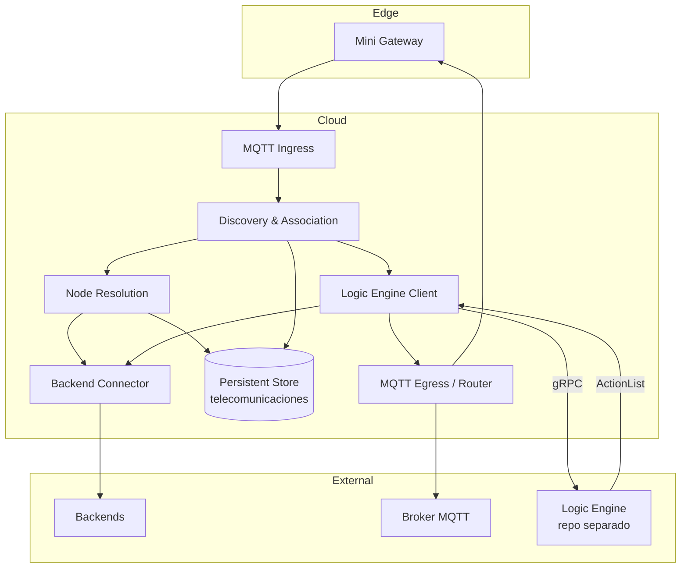

# C2 — Container Diagram — Gateway-Cloud

## Descripción

Gateway-Cloud es una capa de telecomunicaciones para instalaciones pequeñas con mini gateways. No contiene lógica de negocio: delega el procesamiento de mensajes al Logic Engine vía gRPC y ejecuta las acciones devueltas.

La arquitectura distingue dos ejes principales:

- **descubrimiento y asociación** por `mini gateway + nodo`
- **routing y operación** por `servidor MQTT asociado al nodo`

Además:

- la asociación `nodo -> servidor MQTT` se resuelve una vez y se guarda en caché persistente
- la asociación `nodo -> mini gateway` puede cambiar inmediatamente cuando otro mini gateway vuelve a ver el nodo
- cada redescubrimiento se trata como un nuevo avistamiento lógico, reutilizando la resolución previa del servidor MQTT

---

## Contenedores

### 1. MQTT Ingress
**Responsabilidad**
- Recibir mensajes MQTT desde mini gateways
- Validar mensaje mínimo
- Entregar eventos al flujo interno

**Entradas**
- Mensajes MQTT desde mini gateways

**Salidas**
- Eventos hacia Discovery & Association
- Eventos hacia Logic Engine Client cuando ya están resueltos

---

### 2. Discovery & Association
**Responsabilidad**
- Registrar que un nodo ha sido visto por un mini gateway
- Mantener la asociación `nodo <-> mini gateway`
- Tratar cada aparición como redescubrimiento lógico
- Decidir si un nodo ya está resuelto o debe pasar por resolución

**Entradas**
- Eventos desde MQTT Ingress

**Salidas**
- Actualización de `nodo <-> mini gateway`
- Solicitud a Node Resolution si falta resolución
- Evento enriquecido hacia Logic Engine Client

---

### 3. Node Resolution
**Responsabilidad**
- Consultar secuencialmente los backends hasta encontrar el `node_id`
- Obtener el servidor MQTT asociado al nodo
- Persistir la resolución `nodo -> servidor MQTT`

**Entradas**
- Solicitudes desde Discovery & Association

**Salidas**
- Resolución persistida
- Resultado hacia Discovery & Association / Logic Engine Client

**Notas**
- Solo se ejecuta si el nodo no tiene resolución previa
- La asociación `nodo -> servidor MQTT` es fija

---

### 4. Logic Engine Client
**Responsabilidad**
- Actuar como cliente gRPC hacia el Logic Engine (externo, repo separado)
- Enviar el mensaje enriquecido al Logic Engine: `{node_id, gateway_id, event_type, payload}`
- Recibir la lista de acciones devuelta: `[]Action{type, payload}`
- Entregar las acciones al componente de ejecución correspondiente

**Entradas**
- Eventos ya asociados y resueltos desde Discovery & Association / MQTT Ingress
- Evento `NODE_TIMEOUT` desde Node Worker Manager (cuando un nodo supera el tiempo de inactividad)

**Salidas**
- Acciones hacia MQTT Egress / Server Router (`SEND_TO_NODE`)
- Acciones hacia Backend Connector (`SEND_TO_BACKEND`)
- Descarte si la acción es `IGNORE`

**Notas**
- No contiene lógica de negocio propia
- La lógica de handlers, consumos y alarmas reside en el Logic Engine

---

### 5. Persistent Store (Redis)
**Responsabilidad**
- Guardar estado de telecomunicaciones necesario para operación y recuperación

**Contenido**
- Asociación `nodo <-> mini gateway`
- Resolución `nodo -> servidor MQTT`

**Notas**
- No almacena estado de negocio (consumos, alarmas, sesiones de nodo): eso es responsabilidad del Logic Engine
- La caché de resolución `nodo -> servidor MQTT` es persistente y no requiere invalidación
- No es almacenamiento analítico

---

### 6. MQTT Egress / Server Router
**Responsabilidad**
- Publicar información del nodo en el servidor MQTT correspondiente
- Suscribirse al servidor MQTT asociado al nodo para recibir comandos del backend
- Enviar comandos al mini gateway correcto

**Entradas**
- Acciones `SEND_TO_NODE` desde Logic Engine Client
- Comandos desde brokers MQTT asociados (downlink del backend)

**Salidas**
- Datos al broker MQTT destino
- Comandos al mini gateway

**Notas**
- El routing operativo depende de `servidor MQTT asociado al nodo`
- El topic de publicación depende del gateway actual que ve al nodo

---

### 7. Backend Connector
**Responsabilidad**
- Consultar backends uno a uno para resolver nodos
- Enviar al backend las acciones `SEND_TO_BACKEND` devueltas por el Logic Engine
- Reflejar cambios de presencia, descubrimiento y desconexión

**Entradas**
- Solicitudes de resolución desde Node Resolution
- Acciones `SEND_TO_BACKEND` desde Logic Engine Client

**Salidas**
- Respuestas de resolución hacia Node Resolution
- Notificaciones al backend

---

### 8. Logic Engine (externo)
**Responsabilidad**
- Aplicar la lógica de negocio sobre los mensajes recibidos
- Devolver las acciones a ejecutar

**Protocolo**
- gRPC (servidor)
- Request: `{node_id, gateway_id, event_type, payload}`
- Response: `[]Action{type, payload}`

**Notas**
- Contenedor independiente, repositorio separado
- Compartido con el gateway tradicional de calle
- Sus internals (handlers, estado de negocio, consumos) se documentan en su propio repositorio
- Ver contrato completo en C3

---

## Flujos principales

### Flujo 1 — Descubrimiento inicial
1. Un mini gateway ve un nodo
2. MQTT Ingress recibe el mensaje
3. Discovery & Association guarda `nodo <-> mini gateway`
4. Si no existe resolución, Node Resolution consulta backends uno a uno
5. Se guarda `nodo -> servidor MQTT`
6. Logic Engine Client envía el mensaje al Logic Engine vía gRPC
7. Logic Engine devuelve acciones
8. MQTT Egress / Server Router ejecuta `SEND_TO_NODE` si aplica; Backend Connector ejecuta `SEND_TO_BACKEND` si aplica

### Flujo 2 — Redescubrimiento
1. Un mini gateway vuelve a ver un nodo
2. Se trata como redescubrimiento lógico
3. Se actualiza `nodo <-> mini gateway`
4. Se reutiliza `nodo -> servidor MQTT`
5. Logic Engine Client delega al Logic Engine y ejecuta las acciones devueltas

### Flujo 3 — Nodo visto por otro mini gateway
1. Llega un evento desde otro mini gateway
2. Se reasocia inmediatamente `nodo <-> mini gateway`
3. Se mantiene el mismo `nodo -> servidor MQTT`
4. El backend pasa a reflejar el gateway real que ve ese nodo

### Flujo 4 — Comandos (downlink)
1. El sistema recibe el comando por el servidor MQTT asociado
2. MQTT Egress / Server Router lo entrega al Logic Engine Client con `event_type: BACKEND_COMMAND`
3. Logic Engine devuelve `SEND_TO_NODE`
4. El comando se envía al mini gateway del nodo

### Flujo 5 — Timeout de nodo
1. Node Worker detecta inactividad del nodo
2. Logic Engine Client envía `event_type: NODE_TIMEOUT` al Logic Engine
3. Logic Engine ejecuta cálculo final de consumos y devuelve acciones
4. Gateway-Cloud ejecuta las acciones (ej. `SEND_TO_BACKEND` con consumo final)
5. Se limpia la asociación `nodo <-> mini gateway` del Persistent Store
6. El worker se destruye

---

## Reglas ya cerradas

- El mini gateway no tiene lógica de negocio
- Gateway-Cloud es una capa de telecomunicaciones, sin lógica de negocio propia
- Toda la lógica de negocio reside en el Logic Engine (repositorio separado, compartido con gateway de calle)
- La comunicación entre Gateway-Cloud y Logic Engine es gRPC síncrono
- La comunicación entre Gateway-Cloud y mini gateways es asíncrona sobre MQTT
- La fase de descubrimiento se basa en `mini gateway + nodo`
- La fase de routing se basa en `servidor MQTT asociado al nodo`
- La resolución `nodo -> servidor MQTT` se busca secuencialmente en backends
- La resolución se guarda en caché persistente
- La asociación `nodo -> servidor MQTT` es fija
- La asociación `nodo <-> mini gateway` puede cambiar inmediatamente
- El sistema debe soportar múltiples zonas horarias
- El sistema no debe perder ni duplicar datos

---

## Mermaid — C2

