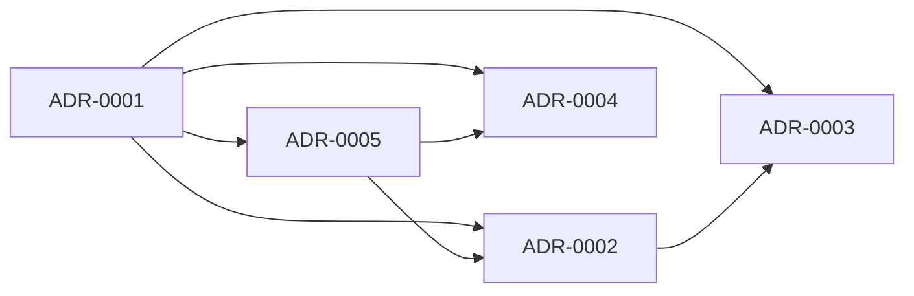

# ADR Index — Metal Gear

Este directorio define las decisiones arquitectónicas para Metal Gear con un formato estable y parseable.

## Convención

- Formato de archivo: `ADR-XXXX-slug.md`
- Orden: incremental por fecha de aceptación
- Metadata obligatoria en cabecera YAML (frontmatter)
- Relaciones explícitas entre ADRs (`related_adrs`, `supersedes`, `superseded_by`)

## Objetivo de estructura

La estructura está pensada para:

1. Convertir ADRs a esquema JSON/DB sin transformaciones complejas.
2. Entender dependencias entre decisiones.
3. Ver interfaces internas y salidas al exterior para integración con otros proyectos.

## ADRs actuales

- ADR-0001: Arquitectura por capas y migración incremental desde runtime legacy
- ADR-0002: Contratos de comunicación MQTT (legacy, Ender OTAP y local)
- ADR-0003: Máquina de campaña OTAP y estado compartido
- ADR-0004: Watchdogs como subsistema de resiliencia y export de estado
- ADR-0005: Frontera de adaptadores de infraestructura para integración externa

## Grafo de dependencias

## Archivos de soporte para esquema

- Catálogo JSON: [docs/adr/adr-catalog.json](docs/adr/adr-catalog.json)
- Plantilla base: [docs/adr/ADR-0000-template.md](docs/adr/ADR-0000-template.md)
