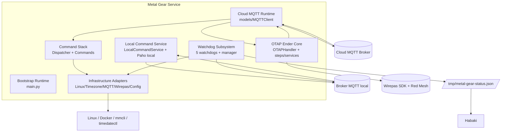

# C4 Nivel 2 — Contenedores (internos) de Metal Gear

Fecha de revisión: 2026-04-30  
Estado: reflejo del runtime actual + módulos nuevos del roadmap ya presentes en código.

## Vista general

Aunque Metal Gear se despliega como un único servicio de systemd, internamente está organizado en contenedores lógicos (módulos principales):

1. **Bootstrap & Runtime** (`main.py`)
2. **Cloud MQTT Runtime (legacy + OTAP Ender)** (`models/mqtt_client.py`)
3. **Local MQTT Command Service** (`src/application/services/local_command_service.py`)
4. **OTAP Ender Core** (`src/domain/otap/*`)
5. **Watchdog Subsystem** (`src/watchdogs/*`)
6. **Infrastructure Adapters** (`src/infrastructure/*`)
7. **Application/Domain command stack** (`src/application/services/command_dispatcher.py`, `src/domain/commands/*`)

## Diagrama de contenedores

## Contratos principales entre contenedores

- **MQTT externo**
  - Legacy: `cl-req/gw/{gw_id}` y `cl-req/gw/gateway_data`
  - Nuevo OTAP: `ender/command/otap/{step}/{gateway_id}`
- **Respuestas cloud**
  - Legacy: `cl-res/gw/gateway_data`
  - OTAP: `ender/status/otap/{step}/{gateway_id}`
- **MQTT local**
  - Comandos: `gateway/command/wirepas/{gw_id}`
  - ACK: `gateway/response/wirepas/{gw_id}`
- **Estado Habaki**
  - JSON atómico en `/tmp/metal-gear-status.json`

## Qué es nuevo (roadmap) y ya visible en código

- Arquitectura por capas `src/domain`, `src/application`, `src/infrastructure`.
- `OTAPHandler` modular con `steps/` y `services/`.
- Watchdogs unificados bajo `BaseWatchdog` + `WatchdogManager`.
- Interfaces/puertos (`MQTTPort`, `SystemPort`, `WirepasPort`).
- `PahoMQTTClient` desacoplado y `LocalCommandService` dedicado.
- Integración Habaki por watchdog de estado.

## Estado de transición detectado

- El runtime principal sigue arrancando por `main.py` (raíz) y utiliza `models/MQTTClient` para cloud.
- Existe `MQTTService` + `CommandDispatcher` modernos en `src/application/services`, pero aún no son el entrypoint principal del proceso.
- Esto es coherente con una fase de migración incremental descrita en roadmap.
