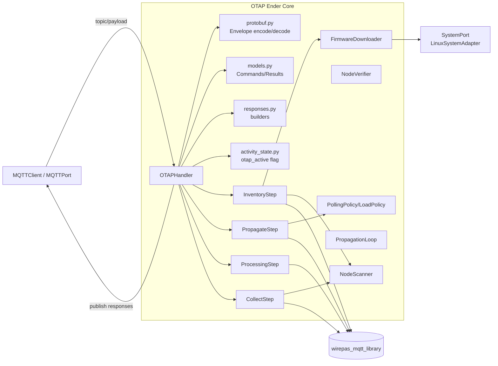
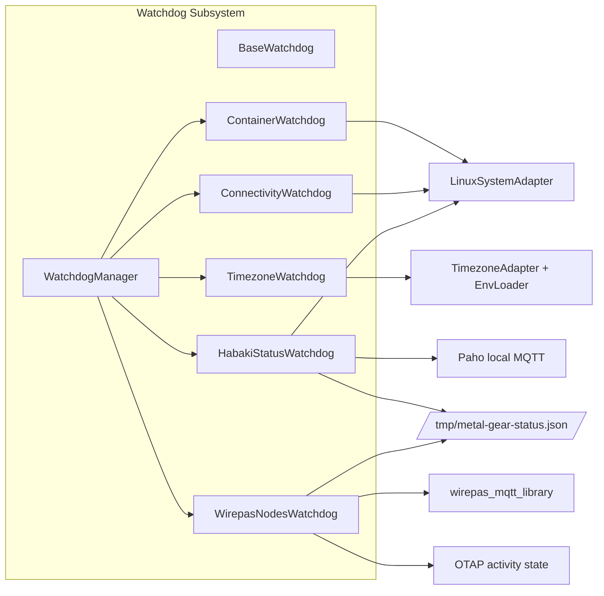

# C4 Nivel 3 — Componentes

Fecha de revisión: 2026-04-30  
Alcance: componentes internos críticos ya implementados.

## 3.1 Componentes del contenedor **OTAP Ender Core**

### Diagrama

### Responsabilidades por componente

- **`OTAPHandler`**: router de steps, ciclo de campaña, watchdog de campaña, publicación de respuestas.
- **`protobuf.py` / `models.py` / `responses.py`**: contrato de mensajes Ender ↔ gateway.
- **`InventoryStep`**: descarga firmware + conexión Wirepas + inventario de nodos y secuencia máxima.
- **`PropagateStep`**: carga scratchpad, arranque de propagación y lectura parcial de progreso.
- **`ProcessingStep`**: transición a fase de procesado, con reintentos acotados.
- **`CollectStep`**: clasificación final de nodos actualizados/no actualizados.
- **Servicios (`NodeScanner`, `FirmwareDownloader`, políticas)**: utilidades especializadas para no mezclar lógica en el handler.

---

## 3.2 Componentes del contenedor **Watchdog Subsystem**

### Diagrama

### Responsabilidades por componente

- **`WatchdogManager`**: arranque/parada centralizados.
- **`ContainerWatchdog`**: asegura contenedores críticos activos.
- **`TimezoneWatchdog`**: calcula timezone por coordenadas y lo persiste.
- **`ConnectivityWatchdog`**: política de backoff y programación de wakeup.
- **`HabakiStatusWatchdog`**: compone snapshot operativo consumido por Habaki.
- **`WirepasNodesWatchdog`**: mantiene máximo diario de nodos, sincroniza `wirepas.connected_nodes`.

---

## Cobertura de documentación

Con este nivel 3 quedan cubiertos los dos núcleos funcionales más relevantes del estado actual:

1. OTAP Ender (lo nuevo más crítico del roadmap).
2. Monitorización/autosanación + integración Habaki.

Esto deja la base lista para redactar ADRs en la siguiente iteración.
